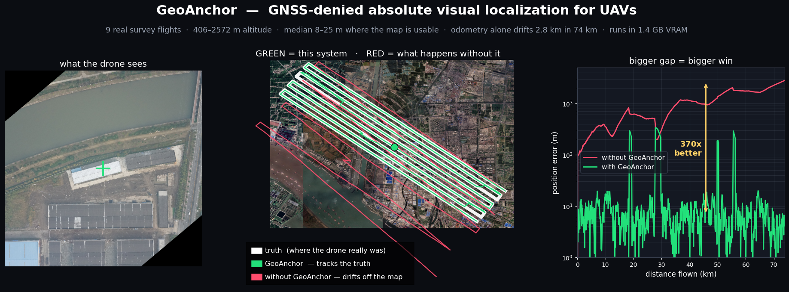
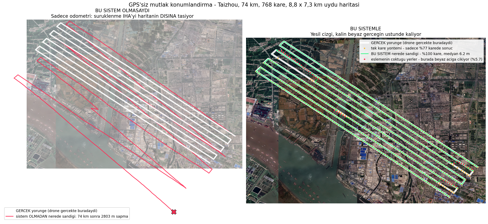
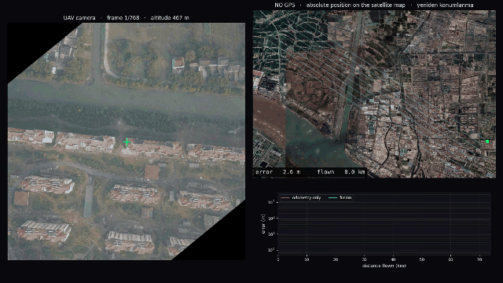
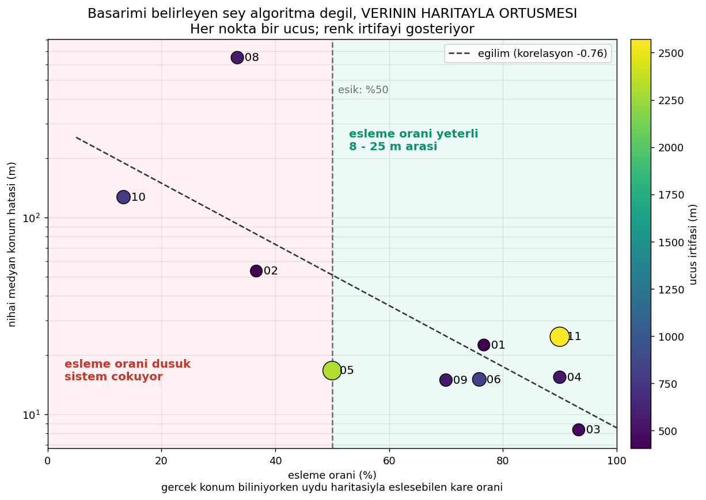
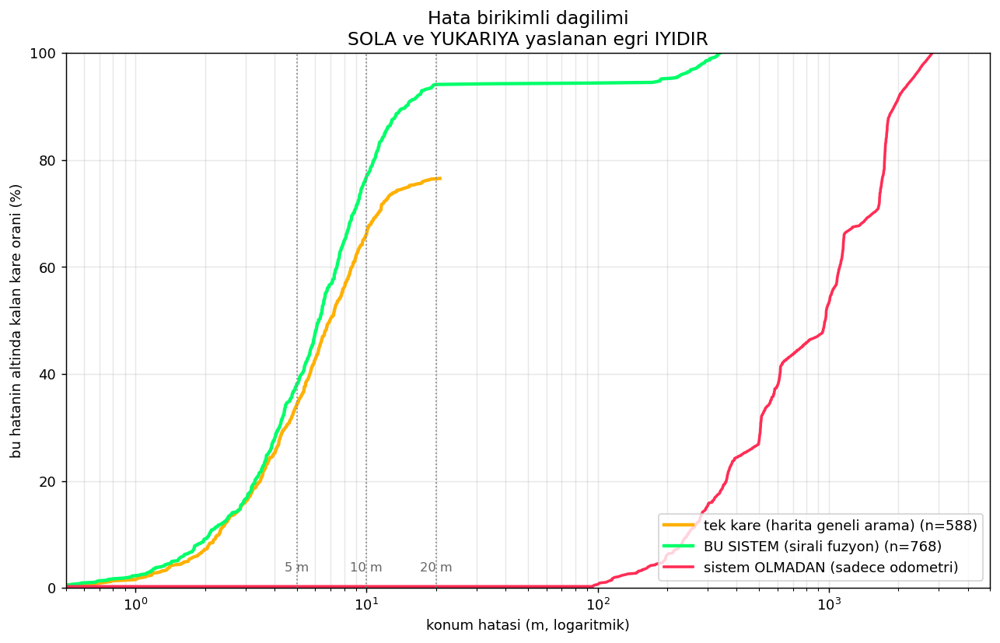
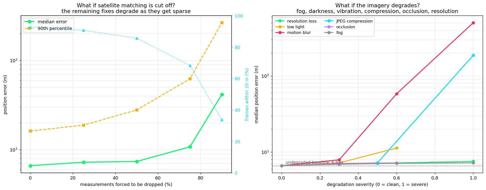
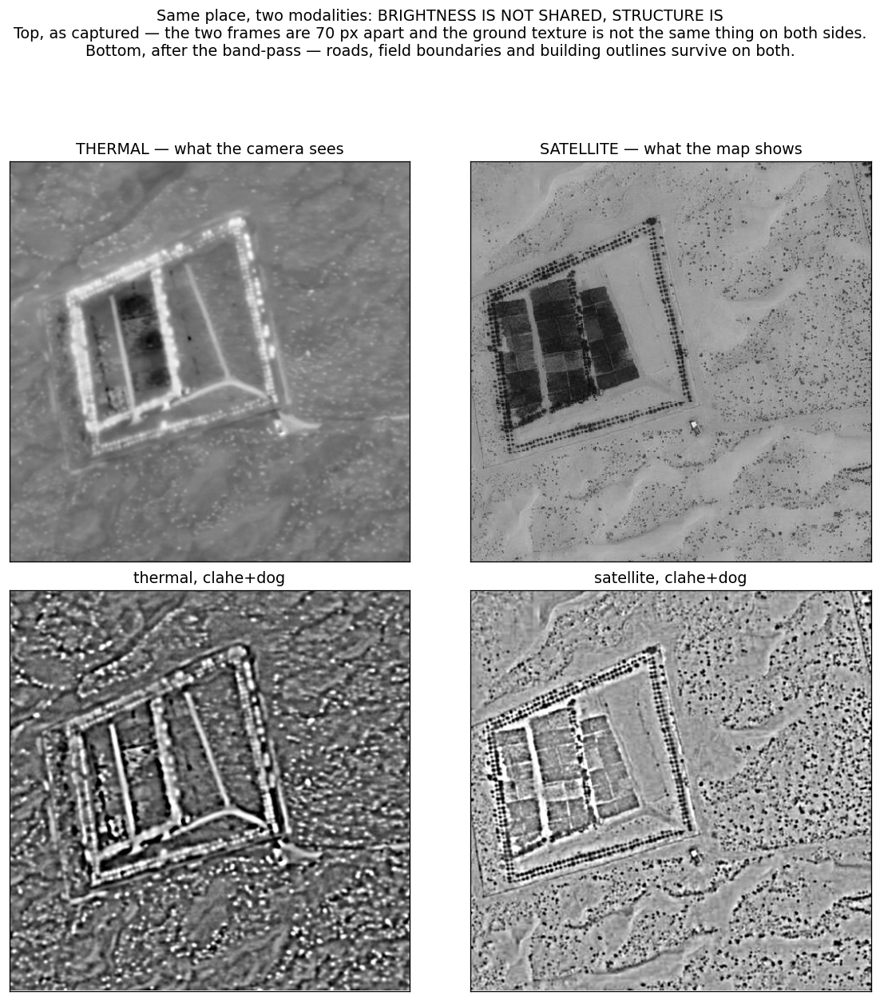
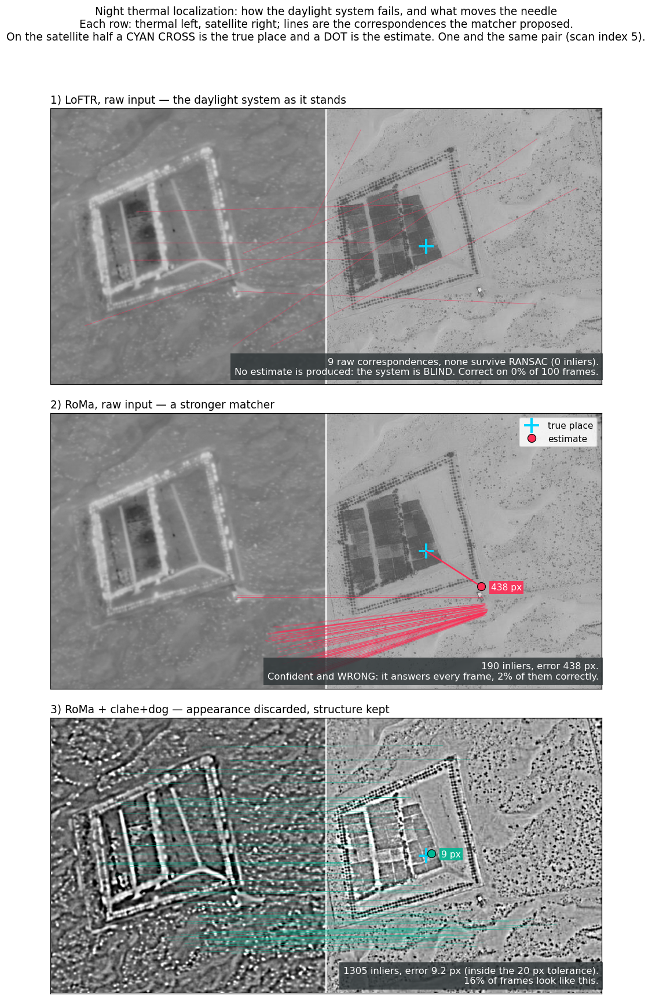
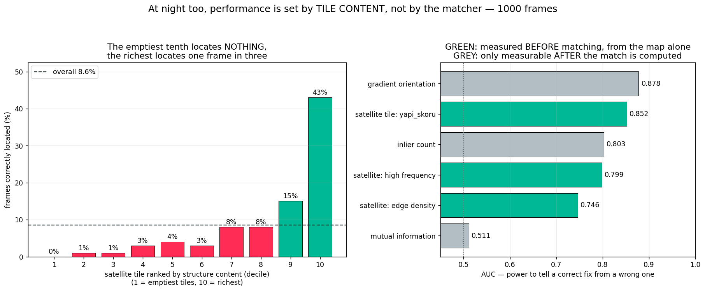

# GeoAnchor — GNSS-Denied Absolute Visual Localization for UAVs

*[Türkçe sürüm için: **[README.tr.md](README.tr.md)**]*



A UAV whose GPS is jammed does not know where it is. Visual odometry gives
relative motion but **drifts** — on this 74 km flight it ends up **2.8 km**
off. Matching the camera against a satellite map gives absolute position but
is **unreliable frame to frame** — on this flight it fails outright on **23%**
of frames (water, uniform farmland, repeating building patterns).

GeoAnchor fuses the two in a particle filter. Neither is sufficient alone;
together they give continuous, drift-free, metre-level positioning with **no
GNSS of any kind**.





*Left: the UAV camera. Right: live position on the satellite map — cyan is truth, green is the estimate, red is odometry-only. Bottom: error against distance flown. This 12-second clip deliberately includes one of the segments where satellite matching collapses entirely: the green error curve spikes, the filter coasts on odometry, and then re-anchors.*

---

**New here?** The [**GeoAnchor Handbook**](https://claude.ai/code/artifact/4e74f825-8ffb-4469-8efa-68d9fb4e0b62) explains the whole project
from the ground up — what the problem actually is, every model that went in, every
model that got thrown out and the measurement that threw it, the settings that
matter, and the traps that cost real time. Start there; this README is the
reference.

A manuscript covering this work is in [`paper/`](paper/) —
*Knowing When You Do Not Know: Sequential Map-Anchored Visual Localization for
GNSS-Denied UAV Flight*, IEEE conference format, built from the same result
files quoted below. See [`paper/ARXIV.md`](paper/ARXIV.md) for submission
metadata.

---

## Headline result

Evaluated on **ten real UAV survey flights** (UAV-VisLoc) spanning
**406 m to 2572 m altitude**, 9 to 103 km per flight, seven terrain types,
and acquisition dates from 2016 to 2023. Ground truth is post-processed GNSS
(measured cross-track scatter on straight legs: **1.5 m**, so the reference
itself is clean). Everything below is fully automatic — scale and camera
boresight are calibrated per flight from that flight's first 20%, and
evaluated on the remaining 80%.

| Flight | Frames | Altitude | Distance | Match rate | Coverage | Median | p90 |
|---|---|---|---|---|---|---|---|
| 03 | 768 | 466 m | 74 km | 93% | 100.0% | **8.35 m** | 20.03 m |
| 09 | 766 | 546 m | 77 km | 70% | 100.0% | **14.94 m** | 59.33 m |
| 06 | 344 | 834 m | 24 km | 76% | 99.7% | **15.06 m** | 365.32 m |
| 04 | 738 | 544 m | 83 km | 90% | 100.0% | **15.44 m** | 54.64 m |
| 05 | 473 | 2313 m | 30 km | 50% | 99.8% | **16.69 m** | 182.51 m |
| 01 | 817 | 406 m | 66 km | 77% | 100.0% | **22.51 m** | 114.60 m |
| 11 | 590 | 2572 m | 84 km | 90% | 99.8% | **24.79 m** | 424.41 m |
| 02 | 1071 | 406 m | 86 km | 37% | 99.7% | 53.45 m | 343.39 m |
| 10 | 144 | 773 m | 9 km | 13% | 84.7% | 126.88 m | 324.98 m |
| 08 | 1033 | 551 m | 103 km | 33% | 79.7% | 648.49 m | 3785.02 m |

**The results split cleanly into two groups, and a single measurable property
predicts which group a flight falls into.** That property is the *match rate*:
the fraction of frames that match the satellite map when the true position is
already known — a property of the data, not of the algorithm.

| | Flights | Median error | Coverage |
|---|---|---|---|
| Match rate **≥ 50%** | 7 | **8.35 – 24.79 m** (median 15.44 m) | ≥ 99.7% |
| Match rate **< 50%** | 3 | 53 – 648 m | 80 – 85% |

Correlation between match rate and log error: **−0.764**.

Altitude is *not* the discriminator — flight 11 at 2572 m works (24.79 m)
while flight 08 at 551 m fails. What matters is whether the drone imagery and
the satellite basemap depict a recognisably similar world. This is
operationally useful: **the match rate can be measured on a planned route
before flying, so you know in advance whether the system will work there.**



### Flight 03 as a detailed case study

The rest of this document dissects flight 03 (768 frames, 74 km, 77 minutes,
466 m AGL, over an 8.8 × 7.3 km orthophoto of Taizhou). With the boresight
hand-calibrated rather than derived automatically:

| | Coverage | Median error | p90 | Within 10 m | Match calls / frame |
|---|---|---|---|---|---|
| Visual odometry only | 100% | drifts to **2803 m** | — | 0% | 0 |
| Single-frame map matching | **76.6%** | 5.46 m | 10.71 m | 66.1% | 3.80 |
| **GeoAnchor (fusion)** | **100%** | **6.20 m** | 14.76 m | **76.8%** | **1.52** |

Excluding the four segments where satellite matching collapses entirely
(5.7% of frames — see *Honest limitations*), the fused system holds
**median 5.97 m, p90 11.97 m, 99.9% within 20 m**.

The gap between 6.20 m here and 8.35 m in the multi-flight table is the price
of full automation: the automatic per-flight boresight calibration is about
2 m worse than one tuned by hand. That is the honest cost, and it is reported
rather than hidden by quoting the better number.



The fusion is not only more accurate than either input — it is **2.5×
cheaper** than searching the map every frame, because knowing roughly where
you are turns a global search into a single local check.

---

## Why this is not just "image retrieval on a satellite map"

The published literature on UAV cross-view geo-localization is dominated by
**single-image** retrieval, and the standard benchmark is saturated
(University-1652 sits at 97.5% Recall@1 as of March 2026). But a real UAV does
not take one photograph — it flies a **trajectory**. Almost nothing in the
recent UAV literature exploits that. The one close piece of work,
*BEV-Patch-PF* (Dec 2025), does sequential Bayesian filtering for **ground
vehicles**, not aircraft.

GeoAnchor is built around the sequence:

1. **Visual odometry** supplies the motion model.
2. **Satellite matching** supplies absolute fixes — and is allowed to fail.
3. **A particle filter** carries multiple hypotheses, rejects outlier fixes,
   and coasts through blackouts.
4. **The map calibrates the aircraft's own sensors, online** (see below).

---

## The part I did not expect: the system calibrates its own compass

The homography that aligns a north-up UAV frame to a north-up satellite tile
has a rotation component. If that residual rotation is not zero, the
**heading angle itself is wrong by exactly that much**.

Measuring it across the flight showed the heading error depends on which way
the aircraft is pointing — **−1.93°** on the northwest legs, **−7.08°** on the
southeast legs. That direction-dependent signature is the classic fingerprint
of magnetometer hard-iron error, the thing aircraft fix with a "compass swing".

Cross-checking against ground truth confirmed it: the odometry direction bias
computed from GNSS was **+1.65°** and **+7.22°** — same magnitudes, opposite
sign, exactly as the geometry predicts.

| | Measured from the map (no GNSS) | Computed from ground truth |
|---|---|---|
| Northwest legs | −1.93° (σ 0.86) | +1.65° |
| Southeast legs | −7.08° (σ 1.73) | +7.22° |

So the aircraft can measure and correct its own compass deviation against the
map, with no GNSS at all. Feeding this back into the odometry cut its drift
from **3.795%** to **0.865%** of distance travelled — 2803 m → 639 m over
74 km. The same trick recovers scale (terrain elevation changes the true
ground sampling distance) from the homography's scale component.

---

## Two other things the data was hiding

**The dataset's own metadata is wrong in two places.** Both were found by
measurement, not by reading the documentation.

1. *The attitude channels are swapped.* The dataset states "Omega = pitch,
   Kappa = roll". Regressing the localization error in the body frame gives
   along-track ~ Kappa with coefficient **+0.981** (R² 0.677) and cross-track
   ~ Omega with coefficient **−0.972** (R² 0.765). Coefficients landing on ±1
   mean the physics (ground offset = altitude × tan θ) is exactly right and
   only the labels are reversed.

2. *Phi1, not Phi2, is the camera heading.* Phi2 matches the flight's ground
   course to a median of 0.00°, which looks convincing — but LoFTR matching
   against the satellite leaves ~0° residual with Phi1 and ~12° with Phi2. The
   12° gap is the wind crab angle: Phi1 is where the nose points, Phi2 is
   where the aircraft actually goes.

**The camera is mounted 2° nose-down.** At 466 m altitude, a 2° tilt puts the
image centre **16 m** ahead of the aircraft on the ground. This was the single
largest error source. Calibrating it on the first 20% of the flight and
evaluating on the remaining 80%:

| | Before | After |
|---|---|---|
| Median error | 16.82 m | **6.12 m** |
| Within 5 m | 2.6% | **40.0%** |
| Within 10 m | 17.4% | **80.9%** |

---

## How it works

```
UAV frame ──rotate by −heading, scale by altitude──► north-up, metric crop
                                                          │
                    ┌─────────────────────────────────────┤
                    ▼                                     ▼
        DINOv2 global descriptor                 LoFTR dense matching
        (2709 satellite tiles indexed)           against a 400 m crop
                    │                                     │
                    │ candidate regions                   │ homography
                    ▼                                     ▼
              ┌───────────────────────────────────────────────┐
              │  attitude correction: image centre → aircraft  │
              │  online calibration: compass bias, scale       │
              └───────────────────────────────────────────────┘
                                    │
   visual odometry ────────────────►│ PARTICLE FILTER ──► position + uncertainty
   (SIFT, consecutive frames)       │  motion + multi-hypothesis measurement
                                    └───────────────────────────────────────
```

**Why a particle filter and not a Kalman filter.** Satellite-matching error is
not Gaussian. Most of the time it is right to a few metres; occasionally it
confidently points at a completely different place (a similar field, the same
building pattern one block over). That distribution is multi-modal and
heavy-tailed. A Kalman filter assumes a single Gaussian mode and one such
outlier drags it permanently off. The particle filter keeps several hypotheses
alive and decides over time which one is consistent with the flight, and a
flat outlier floor in the likelihood stops any single bad fix from wiping out
the belief.

**Why LoFTR and not SIFT for map matching.** The satellite imagery is from a
different season than the flight — autumn golden fields against dark green
ones, different sun angle, buildings that were not there yet. Measured on the
same four frames: SIFT yielded 12/4/24/7 inliers; LoFTR yielded
**104/21/280/140**. Detector-free dense matching survives the appearance gap;
classical keypoints do not. (SIFT *is* used for odometry between consecutive
UAV frames, where no appearance gap exists — it is faster and runs on the CPU,
leaving the GPU to the map matching.)

---

## Ablation — which parts actually earn their place

Each row removes one component from the full system. Same 300 frames, same seed.

| Removed | Median | p90 | Within 20 m | Match calls |
|---|---|---|---|---|
| *nothing (full system)* | **6.62 m** | 16.17 m | **92.7%** | 1.73 |
| Online scale calibration | 7.03 m | 17.18 m | 91.7% | 1.74 |
| Particle injection | 7.62 m | 19.50 m | 90.7% | 1.73 |
| Online compass calibration | 7.85 m | 18.53 m | 90.7% | 1.73 |
| Visual odometry (measurement only) | 9.98 m | **367.66 m** | 77.7% | 1.99 |
| **Attitude / boresight correction** | **17.13 m** | 29.93 m | **67.3%** | 1.75 |

**Two components do not earn their place, and saying so matters more than
claiming everything was essential:**

| Variant | Median | Within 20 m |
|---|---|---|
| 100 particles (vs 600) | 7.08 m | 92.7% |
| 2000 particles (vs 600) | 6.80 m | 92.7% |
| **No outlier floor in the likelihood** | **6.76 m** | **93.3%** |

The filter is not particle-starved — 100 particles is nearly as good as 2000,
so the state space is small enough that sampling is not the bottleneck. And
removing the outlier floor changes nothing measurable, because the measurement
gate and the injection mechanism already handle bad fixes before the
likelihood ever sees them. It stays in the code as a cheap safety net, but on
this data it is dead weight.

The two rows that matter most are worth restating: **the boresight correction
is by far the largest single contributor** (17.13 → 6.62 m), and **removing
odometry does not hurt the median much but destroys the tail** (p90 goes from
16 m to 368 m) — which is exactly what a motion model is for.

---

## Robustness — 20 conditions

Two questions: what happens when satellite matching is unavailable, and what
happens when the image itself degrades. 300 frames per condition.

**Measurement outage** (satellite fixes forcibly discarded):

| Fixes discarded | Median | Within 10 m | Match calls / frame |
|---|---|---|---|
| 0% | 6.62 m | 73.3% | 1.73 |
| 25% | 7.23 m | 70.7% | 1.26 |
| 50% | 7.38 m | 66.7% | 0.85 |
| 75% | 10.76 m | 46.7% | 0.45 |
| 90% | 41.55 m | 17.0% | 0.22 |

Half the map fixes can be thrown away for a cost of 0.8 m. That is the motion
model doing its job.

**Image degradation** — the pattern is sharper than I expected:

| Harmless (all around 7 m) | Breaks the system |
|---|---|
| Fog, even at maximum severity — 7.21 m | Motion blur, moderate — 58.31 m |
| Occlusion covering a third of the frame — 7.20 m | Heavy JPEG compression — 186.71 m |
| Resolution loss — 7.54 m | Motion blur, heavy — 500.19 m |
| Moderate JPEG, moderate darkness, mild blur | Extreme darkness — **never initializes** |

**The system does not care about brightness or contrast. It cares about
texture.** Fog flattens contrast but leaves the road a road and the building a
building, so matching still works. Motion blur and heavy compression destroy
fine structure, and then there is nothing left to match against.

The extreme-darkness row is worth stating plainly: the system produces no
position at all, because the very first frame cannot be located on the map.
For night operation this design needs a thermal or low-light sensor, not a
software fix.



---

## Fixing the blur weakness

Motion blur was the one real failure mode, so I went after it. Two ideas,
tested separately because they address different situations.

**Idea 1 — a sharpness gate.** Skip matching entirely on frames much blurrier
than their neighbours; let odometry carry them. The counter-intuitive part is
that a blurry frame does not simply fail to match — it produces a
*confidently wrong* match, which is worse than no match at all, because the
filter can coast through a missing measurement but is dragged off by a wrong one.

**Idea 2 — domain equalisation.** Blur the satellite tile by the same amount.
Matching works when both sides look alike. The problem is measuring "how
blurred am I" with no sharp reference — a camera that has only ever seen blur
cannot know it is blurred. The reference turned out to be already in hand:
**the satellite tile itself is sharp**, and it shows the same ground at the
same scale, so the sharpness gap between them *is* the blur.

Results (300 frames):

| Every frame blurred (moderate) | Median | p90 | Within 20 m |
|---|---|---|---|
| Uncorrected | 44.47 m | 214.31 m | 22.7% |
| Sharpness gate only | 27.06 m | 208.08 m | 38.8% |
| **Domain equalisation only** | **20.00 m** | **90.88 m** | **50.2%** |
| Both | 20.00 m | 90.88 m | 50.2% |

| Occasional blur (every 6th frame, heavy) | Median | Match calls / frame |
|---|---|---|
| Uncorrected | 6.83 m | 2.11 |
| **Sharpness gate** | 6.83 m | **1.46** |

**Domain equalisation is the real fix**: median halved, p90 down from 214 m to
91 m. **The sharpness gate did not do what I predicted.** I expected it to
improve accuracy on intermittent blur; it did not, because the filter's
outlier rejection was already handling those frames. What it does is cut
matching work by 31% — it stops wasting effort on frames that cannot be
matched. A real benefit, just not the one I was aiming for.

Neither costs anything on clean frames (6.62 m to 6.60 m).

Honest verdict: blur is **mitigated, not solved**. 44 m down to 20 m is a real
improvement, but the clean-frame baseline is 6.6 m. Heavy vibration remains
this system's genuine limit.

---

## The stronger matcher that made things worse

The nine-flight analysis pointed at one bottleneck: match quality. So the
obvious next move was a stronger matcher — RoMa, the current state of the art
in dense matching, and far more robust to appearance change than LoFTR.

**At first it looked like a clear win.** Measured at the known true position,
on the same frames:

| Flight | LoFTR inliers / match rate | RoMa inliers / match rate |
|---|---|---|
| 03 | 468 / 100% | 4342 / 100% |
| 01 | 118 / 75% | 1766 / 96% |
| 05 | 65 / 54% | 1658 / 100% |
| 02 | 12 / 42% | 704 / **100%** |
| 08 | 14 / 29% | 2935 / **100%** |
| 10 | 0 / 12% | 160 / **96%** |

All three failing flights jumped above the threshold. It fit in 2.7 GB VRAM.
I was ready to report it as the fix.

**Then the end-to-end run gave 1669 m on flight 01, where LoFTR gives 22 m.**

The bake-off had asked the wrong question. It only ever showed each matcher
the *correct* satellite tile. A localization system spends most of its effort
on the opposite question — *is this the right place at all?* So I measured
that: match each drone frame against a satellite crop from a random, unrelated
part of the map.

| | Inliers at the CORRECT place | Inliers at a WRONG place | Ratio |
|---|---|---|---|
| **LoFTR** | 709 | **0** | **709x** |
| **RoMa** | 4598 | **341** | 13.5x |

**LoFTR returns nothing on unrelated imagery. RoMa invents 341 matches.**
RoMa's "100% match rate" was never a capability — it matches everything,
including things that are not there. Its apparent advantage was an artifact of
a metric that only ever measured the easy direction.

Recalibrating the acceptance threshold for RoMa does not rescue it. Testing
every criterion on correct-vs-wrong pairs:

| Criterion | LoFTR | RoMa |
|---|---|---|
| Raw inlier count | **100% clean separation** | 98.1%, distributions overlap |
| Inlier ratio | **100% clean separation** | 98.1%, distributions overlap |
| Matcher confidence | 96.2% | 96.2% |

LoFTR separates the two cases perfectly — there exists a threshold with zero
errors. For RoMa no threshold exists that does: some wrong places outscore
some correct ones.

End-to-end, with thresholds tuned in RoMa's favour:

| Flight | Config | Coverage | Median error |
|---|---|---|---|
| 01 | LoFTR | 100% | **21.82 m** |
| 01 | RoMa, raw threshold 3050 | 99.5% | 39.71 m |
| 01 | RoMa, ratio threshold 0.61 | 100% | 40.53 m |
| 08 | LoFTR | **4.5%** | 582 m |
| 08 | RoMa, raw threshold 3050 | 95.5% | **6250 m** |
| 08 | RoMa, ratio threshold 0.61 | 95.5% | 3689 m |

Flight 08 is the whole argument in one row. LoFTR produces a position on 4.5%
of frames — it is *saying it does not know*. RoMa produces one on 95.5% of
frames, and is on average **6 kilometres wrong**. In the air, the first system
reports loss of fix and hands over to inertial navigation. The second flies
the aircraft six kilometres off course and never mentions it.

**RoMa stays out.** Not because it is a weaker matcher — by conventional
metrics it is clearly stronger — but because this task needs something those
metrics do not measure:

> A matcher's value here is not how much it matches, but whether it can stay
> silent where it should not match at all.

The code keeps `RomaMatcher` and the `--matcher roma` switch so the result is
reproducible, and `accept_ratio` was added to the localizer during this
investigation. The default remains LoFTR.

---

## Night: what happens when you actually bring a thermal sensor

The robustness study ends by saying the extreme-darkness case needs a different
sensor, not a software fix. That is easy to write and easy to leave there, so I
went and measured it, on a **different dataset**:
[Boson-nighttime](https://huggingface.co/datasets/xjh19972/boson-nighttime) —
26,568 aligned thermal/satellite pairs, 512×512 over desert, farmland and
roads, ground truth by construction. It is gated, granted instantly, and its
terms restrict use to non-commercial research. The 85 GB is not in this
repository — the scripts download it, and access is something each user accepts
at the source.

**The daylight system does not degrade at night. It stops.** LoFTR on raw
thermal returns zero inliers on 100 frames out of 100. Not a worse position — no
position.

The reason is visible in one picture. Thermal and optical share almost nothing
about brightness, and almost everything about structure:



So the fix is to throw appearance away. A CLAHE + difference-of-Gaussians
band-pass, applied identically to both sides, is enough to move the needle off
zero. Same pair, three configurations:



| Arm | Correctly located | Precision |
|---|---|---|
| LoFTR, raw | **0%** | — |
| RoMa, raw | 2% | 2% — accepts every frame |
| LoFTR, Sobel | 12% | 86% |
| **RoMa, CLAHE+DoG** | **16%** | 16% |

Note the RoMa row repeats the daylight lesson exactly: it answers on every
frame and is wrong on almost all of them.

### The real problem at night is not matching. It is knowing.

The correct answer is already found on 9–16% of frames. What was missing was a
way to tell those from the rest. Four verification measures, scored by AUC over
**1000 frames** (0.5 is a coin flip):

| Measure | AUC |
|---|---|
| gradient orientation agreement, cos 2Δ | **0.878** |
| inlier count | 0.803 |
| −NCC of band-passed images | 0.781 |
| mutual information | 0.489 — useless |

The inlier count is worth a note. I had written that it stops working at night;
my own measurement refuted that. What broke was the daylight *threshold*, not
the signal.

### Turning that into a gate, honestly

A particle filter survives silence — GeoAnchor already coasts through 23% of
daylight frames. It does not survive a confident wrong fix. So the operating
point is chosen for precision.

The first version of this gate reported **100% precision at 45% recall**, on
five accepted frames, with the threshold chosen on the very frames it was
scored against. Both problems are now fixed: 1000 frames, and the threshold is
fitted on half and measured on the other half over 400 random splits.

| | Precision | Recall |
|---|---|---|
| as first reported (n=5, in-sample) | 100% | 45% |
| **held-out, 1000 frames** | **92%** | **28%** |

### Which 8.6%? The daylight law, again

That leaves the real bottleneck: not the gate, but how few correct fixes exist
to gate. So which frames produce one?

First, a measurement that narrows the options. Do the representations succeed
on the same frames or on different ones? Per-frame records over 150 frames:
Sobel 9%, CLAHE+DoG 9%, DoG 7%, **union 11%**. Repeated on 1000 frames with
DoG and Sobel: 103 and 101 correct, 71 of them the same frames, **union 13%
against 10% for the best single one**. The successes overlap only about half
the time, but each representation's unique wins are traded against its unique
losses, so the union barely moves. **This family of methods is at its
ceiling.** Either the shared structure is there and no untrained matcher can
see it, or on those frames there is nothing shared to find.

Those two have very different price tags, so it is worth an hour to tell them
apart. Score each frame for structure using measures that need no matching and
no ground truth, and see whether that predicts the verdict:



| Measure | AUC | |
|---|---|---|
| structure score, weaker of the two sides | **0.872** | before matching |
| **structure score, satellite tile alone** | **0.852** | **before matching** |
| high-frequency energy fraction, satellite | 0.799 | before matching, *inverted* |
| Canny edge density, satellite | 0.746 | before matching |
| inlier count | 0.803 | after matching |
| gradient orientation agreement | 0.878 | after matching |

**A number read off the basemap alone — no flight, no thermal frame, no
matching — predicts night localizability better than the inlier count measured
after the match.** Sorted into deciles, the least structured tenth of tiles
produces no correct fix at all; the most structured tenth produces 43%.

One assumption of mine was backwards, and the data said so plainly. I expected
high-frequency energy to mean structure; it scored AUC 0.201, which is a strong
predictor pointing the other way. Sand speckle and scrub are fine texture, not
structure: they fill a tile without giving a matcher anything to hold. The
structure score is therefore edge density *minus* high-frequency fraction.

So the daylight law holds at night too, in a stronger form. In daylight the
predictor is the match rate, which needs a trial match along the planned route.
At night it needs only the map.

### The law is also a component

A score computed before matching can decline before the cost is paid, and it is
statistically independent of everything the matcher reports — it never saw the
thermal frame.

| Pre-filter passes | Correct fixes kept | Matching skipped |
|---|---|---|
| 70% of tiles | 98% | 30% |
| **50% of tiles** | **90%** | **50%** |
| 30% of tiles | 77% | 70% |

| Gate (held-out) | Precision | Recall |
|---|---|---|
| post-match only | 92% | 28% |
| pre-match only | cannot reach 90% | — |
| **product of the two** | **93%** | **34%** |

Half the matcher's work can be skipped for 10% of the fixes, and the combined
gate strictly beats the tuned single-score one: same precision, a fifth more
recall, and the pre-match half costs nothing.

### The best operating point: agreement, filtered by the map

One more signal, and it needs no threshold at all: accept a fix when two
band-passed representations independently land within 20 px of each other — 20
px being the accuracy tolerance itself, not a number fitted to anything. On
1000 frames DoG + Sobel agreeing gives **82% precision at 57% recall** (93
accepted, 76 correct). That first showed up on 11 accepted frames and
reproduced almost exactly with eight times the data.

82% is not enough on its own: a confident wrong fix is the one thing a particle
filter cannot absorb. But the pre-match tile score never saw the thermal frame,
so its mistakes are uncorrelated with the matcher's, and it lifts precision
exactly where agreement is weak:

| Pre-filter passes | Accepted | Precision | Recall | Frames with a correct fix | Cost |
|---|---|---|---|---|---|
| — | 93 | 82% | 57% | 7.6% | 2.0× |
| top 70% | 84 | 89% | 56% | 7.5% | 1.4× |
| top 50% | 78 | 91% | 53% | 7.1% | 1.0× |
| **top 30%** | 65 | **95%** | 47% | **6.2%** | **0.6×** |

Cost is RoMa calls per frame of flight; the baseline — one representation, every
frame — is 1.0×. Agreement needs two calls per frame it looks at, and the
pre-filter decides how many frames that is.

| | Precision | Frames with a correct fix | Cost |
|---|---|---|---|
| tuned single-score gate | 92% | 2.4% | 1.0× |
| **agreement + pre-filter (top 30%)** | **95%** | **6.2%** | **0.6×** |

**2.6× the reliable anchor rate, three points more precision, 40% less
compute** — and neither component has a threshold fitted to the labels.

### Where it stands

A trustworthy anchor on **6.2%** of frames, against 70–100% in daylight. That
is a measured finding and a predictor, not a working night system, and it comes
from one dataset.

What the law changes is where effort should go. A trained cross-modal matcher
was the obvious next step while the failure looked like a matcher problem; now
the measurable target is narrower — raise the 43% on tiles that *do* hold
structure, rather than chase the tiles that hold none.

`night/DURUM.md` is the working log for this half of the project.

---

## Honest limitations

Written down first, so nothing here is oversold.

- **Satellite matching collapses over featureless terrain.** Four segments
  (5.7% of frames, longest 21 frames ≈ 2 km of flight) produced zero inliers.
  There the filter coasts on odometry and degrades to a maximum of 338 m
  before re-anchoring. This is real and visible as red dots in the figure — it
  is not smoothed away.
- **Processed offline**, not on the aircraft in flight. Throughput is 866 ms
  per frame on a laptop RTX 3050 Ti; frames arrive every 7 s in this dataset,
  so it is comfortably real-time *for this flight*, but it has not been run on
  embedded hardware.
- **Attitude and altitude are assumed available** from the IMU and a
  barometric/radar altimeter. Neither depends on GNSS, and this matches the
  pose-prior protocol used by the AnyVisLoc benchmark — but it is an
  assumption, and the compass bias result above shows those sensors are not
  perfect either.
- **The boresight calibration uses the first 20% of the flight.** Real systems
  do this once at installation; here it is done from data, and everything
  reported is evaluated on the held-out remainder.
- **Ten flights, all from one dataset, all in China.** Altitudes span
  406–2572 m and dates span 2016–2023, but every flight uses the same capture
  system and the same class of satellite basemap. Nothing here demonstrates
  behaviour over mountains or in winter. The night section does use a
  different sensor, country and terrain, but it is a second single dataset,
  not a survey.
- **The night results are per-frame, never sequential.** Every night number
  above — the gate, the law, the operating point — is measured one frame at a
  time. The thermal dataset is a grid of aligned tiles from several regions
  and nights, not a trajectory, so there is nothing for a motion model to
  integrate over and the particle filter was never run on it. That matters
  more here than it would elsewhere, because this project's own central claim
  is that per-frame results do not predict sequential ones. The night work
  therefore establishes a predictor and an operating point; it does not show
  a UAV flying at night.
- **Three of the ten flights fail** (match rate below 50%: flights 02, 08,
  10 — median error 53 m, 648 m, 127 m). The cause is measured and reported
  rather than excluded: those flights' imagery barely matches the satellite
  basemap even at the known true position. That is a data property, but it is
  also a real operational limit — the system cannot be deployed on a route
  without first checking that the map and the sensor agree there.
- **Flight 07 was excluded outright**: its metadata contains no attitude or
  heading columns, which this system requires. The loader rejects it with an
  explicit error rather than silently producing wrong numbers.
- **The automatic calibration costs about 2 m** versus hand tuning (8.35 m vs
  6.20 m on flight 03), and on two flights it declined to apply any correction
  at all because it could not verify the correction helped on held-out frames.
- **The compass deviation curve is fitted at only two headings**, because the
  survey pattern only flies two. The physical model (hard-iron error) predicts
  a sinusoid in heading, but this flight cannot identify it — with two
  headings it is effectively a two-point lookup.
- **Planar homography assumption.** Valid for near-nadir frames (pitch and
  roll stay within ±5° here); it degrades for oblique views. Building relief
  displacement is the main residual error source and is why ~6 m, not ~1 m, is
  the floor.

---

## Reproducing

```bash
pip install torch torchvision timm kornia opencv-python rasterio gdown \
            numpy pandas matplotlib imageio

# 1. data (2.04 GB sample of UAV-VisLoc, flight 03)
python -m gdown "https://drive.google.com/uc?id=16tY7tPZiNIoyAhknvyXnp0jAfccIcHtL"

python scripts/00_inspect.py          # verify geo-referencing, estimate GSD
python scripts/01b_convention.py      # determine yaw convention empirically
python scripts/02_build_tiledb.py     # DINOv2 descriptors for 2709 tiles
python scripts/03a_cache_northup.py   # cache north-up UAV crops
python scripts/03b_cache_tiles.py
python scripts/03c_retrieval_sweep.py # retrieval quality sweep
python scripts/04f_oracle2.py         # matching accuracy ceiling
python scripts/05_single_frame.py     # PHASE 1 baseline
python scripts/06_odometry.py         # PHASE 2 odometry + drift
python scripts/06c_yaw_from_map.py    # compass bias measured from the map
python scripts/07_sequential.py       # PHASE 3 fusion  ← main result
python scripts/08_robustness.py       # PHASE 4 degradation + outage
python scripts/11_ablation.py         # PHASE 5 ablation
python scripts/09_figures.py          # figures (add --tr for the Turkish set)
python scripts/12_robustness_figure.py
python scripts/13_blur_fix.py             # blur mitigation
python scripts/20_multiflight.py          # 9-flight evaluation
python scripts/21_why_flights_differ.py   # why flights differ
python scripts/23_difficulty_figure.py
python scripts/22_summary.py
python scripts/10_demo_video.py       # demo video

# manuscript: English figures at IEEE column width, then the arXiv tarball
python scripts/30_paper_figures.py
python scripts/31_arxiv_bundle.py

# do the documents still say what results/ says?
python scripts/32_tutarlilik.py
```

The night half needs its own dataset (74 GB) and runs separately:

```bash
python night/indir.py             # download + stream-extract Boson-nighttime
python night/00_olcek.py          # grid unit in pixels, same-modality ceiling
python night/01_taban.py          # three arms: ceiling / LoFTR / RoMa
python night/02_kopru.py roma     # representation sweep
python night/03_dogrulama.py 1000 # which measure separates right from wrong
python night/04_kapi.py           # operating point, held-out
python night/05_kanit.py          # evidence figures
python night/06_uzlasma.py 150    # do the representations find the same frames?
python night/07_yasa.py           # is the failure content or matcher?
python night/08_birlesik.py       # pre-match filter plus post-match gate
```

Hardware used: Windows 11 laptop, **NVIDIA RTX 3050 Ti, 4 GB VRAM**. Peak
usage 1.4 GB — nothing here needs a datacentre GPU.

## Layout

```
src/geo.py              geo-referencing, windowed GeoTIFF access, metric crops
src/flight.py           flight sequence loading
src/features.py         DINOv2 global descriptors (CLS + GeM)
src/tiles.py            satellite tile grid and descriptor database
src/matching.py         LoFTR wrapper + RANSAC similarity
src/geometry.py         attitude-induced offset model, boresight calibration
src/localize.py         single-frame localization (retrieval → verify → correct)
src/odometry.py         visual odometry between consecutive frames
src/particle_filter.py  particle filter with measurement-driven injection
src/sequential.py       the fused sequential system + online calibration
src/degrade.py          six realistic image degradations
```

```
scripts/                every measurement, numbered in the order it was run
night/                  thermal night localization (separate dataset, see night/DURUM.md)
paper/                  the manuscript, its figures and the arXiv bundle
space/                  Hugging Face Space that serves the results interactively
results/                the JSON and NPZ every number in this README comes from
```

`ILERLEME.md` is the full working log — every measurement, every dead end,
every bug found and what it cost. Written as the work happened, in Turkish.

## Data

UAV-VisLoc (Xu et al., 2024, arXiv:2405.11936) — released for non-commercial
research. Satellite basemaps ship with the dataset.

The night section uses Boson-nighttime v1 (`xjh19972/boson-nighttime` on
Hugging Face), released by Xiao et al. with the STHN paper (arXiv:2405.20470).
It is gated but granted instantly; the terms accepted at the gate restrict use
to non-commercial research and education, and the satellite half is Bing
imagery under Microsoft's own terms. The data itself is not committed here —
only the figures needed to show what the measurements mean.

## Licence

MIT for the code. The dataset keeps its own terms.
