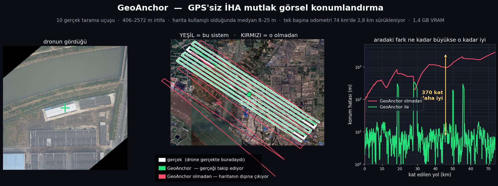
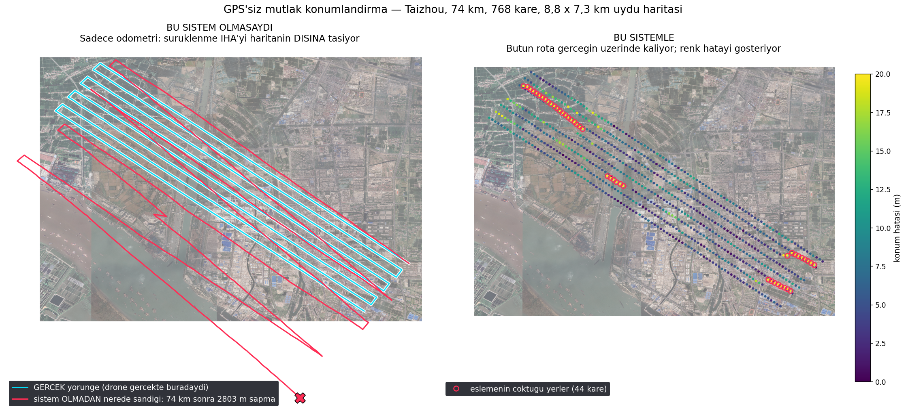
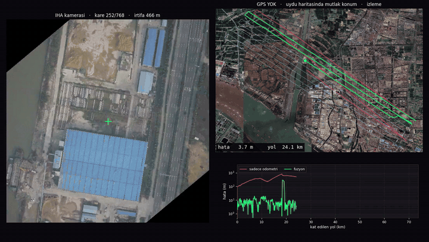
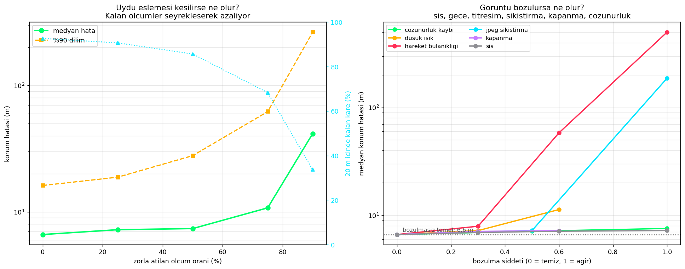
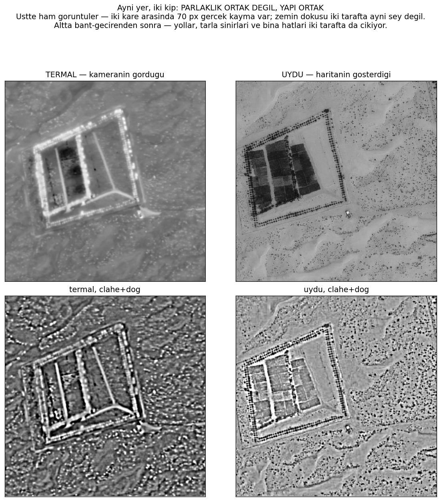
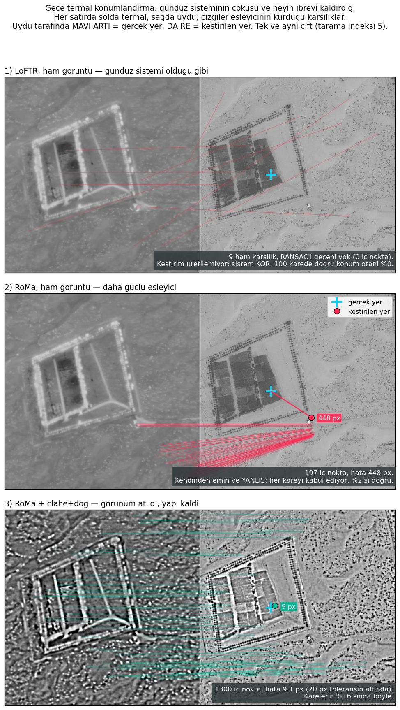
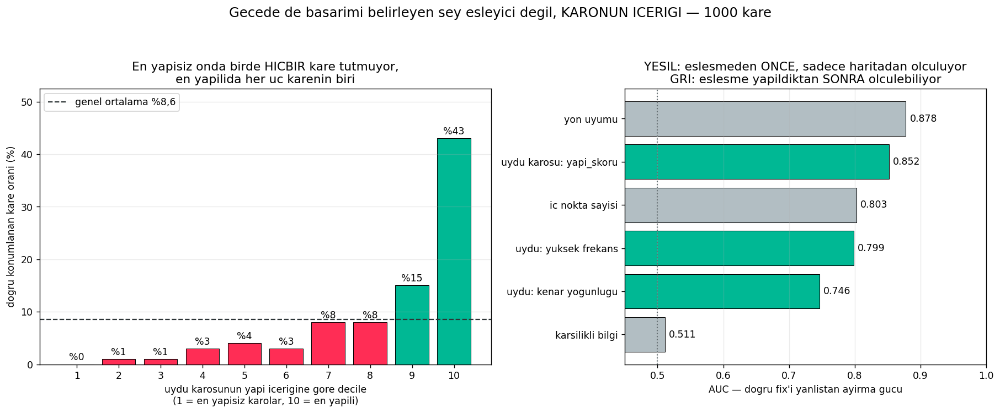

# GeoAnchor — GPS'siz İHA Mutlak Görsel Konumlandırma

*[English version: **[README.md](README.md)**]*



GPS'i karıştırılan bir İHA nerede olduğunu bilmez. Görsel odometri bağıl
hareketi verir ama **sürüklenir** — bu 74 km'lik uçuşta sonunda **2,8 km**
şaşıyor. Kamerayı uydu haritasıyla eşlemek mutlak konum verir ama **kare kare
güvenilmez** — bu uçuşta karelerin **%23'ünde** hiç tutmuyor (su üstü, tekdüze
tarla, tekrar eden yapı deseni).

GeoAnchor ikisini bir parçacık süzgecinde birleştirir. Tek başına hiçbiri
yetmiyor; birlikte, **hiçbir uydu sinyali olmadan**, sürekli ve sürüklenmesiz
metre seviyesi konum veriyorlar.





*Solda İHA kamerası. Sağda uydu haritasında canlı konum — açık mavi gerçek, yeşil kestirim, kırmızı sadece odometri. Altta kat edilen yola göre hata. Bu 12 saniyelik kesit, uydu eşlemesinin tamamen çöktüğü bölümlerden birini bilerek içeriyor: yeşil hata eğrisi fırlıyor, süzgeç odometriyle devam ediyor, sonra yeniden çapa atıyor.*

---

**Tarayıcıda deneyin:** [etkileşimli sonuçlar](https://huggingface.co/spaces/MANOROMAN/GeoAnchor) — on uçuş,
konuşlandırılabilirlik yasası ve gece ölçümleri; hepsi önceden hesaplanmış,
kurulum yok.

**Yeni misiniz?** [**GeoAnchor Handbook**](https://claude.ai/code/artifact/4e74f825-8ffb-4469-8efa-68d9fb4e0b62) projeyi sıfırdan
anlatıyor — problem tam olarak nedir, hangi modeller girdi, hangileri hangi ölçümle
elendi, hangi ayar ne yapar ve hangi tuzaklar gerçekten vakit yedi. Oradan başlayın;
bu README başvuru metni. (İngilizce.)

Bu çalışmanın makalesi [`paper/`](paper/) altında —
*Knowing When You Do Not Know: Sequential Map-Anchored Visual Localization for
GNSS-Denied UAV Flight*, IEEE konferans biçimi, aşağıdaki sonuçların çıktığı
dosyalardan üretiliyor. Gönderim üstverisi: [`paper/ARXIV.md`](paper/ARXIV.md).

---

## Ana sonuç

**On gerçek İHA tarama uçuşunda** değerlendirildi (UAV-VisLoc):
**406 m ile 2572 m arasında irtifa**, uçuş başına 9-103 km, yedi arazi türü,
2016'dan 2023'e yayılan çekim tarihleri. Gerçek konum işlenmiş GNSS verisi —
düz uçuş hatlarındaki ölçülen sapma **1,5 m**, yani referansın kendisi temiz.
Aşağıdaki her şey tam otomatik: ölçek ve kamera montaj açısı her uçuşta o
uçuşun ilk %20'sinden kalibre edilip kalan %80'de ölçülüyor.

| Uçuş | Kare | İrtifa | Yol | Eşleşme oranı | Kapsama | Medyan | %90 |
|---|---|---|---|---|---|---|---|
| 03 | 768 | 466 m | 74 km | %93 | %100,0 | **8,35 m** | 20,03 m |
| 09 | 766 | 546 m | 77 km | %70 | %100,0 | **14,94 m** | 59,33 m |
| 06 | 344 | 834 m | 24 km | %76 | %99,7 | **15,06 m** | 365,32 m |
| 04 | 738 | 544 m | 83 km | %90 | %100,0 | **15,44 m** | 54,64 m |
| 05 | 473 | 2313 m | 30 km | %50 | %99,8 | **16,69 m** | 182,51 m |
| 01 | 817 | 406 m | 66 km | %77 | %100,0 | **22,51 m** | 114,60 m |
| 11 | 590 | 2572 m | 84 km | %90 | %99,8 | **24,79 m** | 424,41 m |
| 02 | 1071 | 406 m | 86 km | %37 | %99,7 | 53,45 m | 343,39 m |
| 10 | 144 | 773 m | 9 km | %13 | %84,7 | 126,88 m | 324,98 m |
| 08 | 1033 | 551 m | 103 km | %33 | %79,7 | 648,49 m | 3785,02 m |

**Sonuçlar temiz biçimde ikiye ayrılıyor ve bir uçuşun hangi gruba düşeceğini
tek bir ölçülebilir özellik önceden söylüyor.** O özellik *eşleşme oranı*:
gerçek konum zaten biliniyorken uydu haritasıyla eşleşebilen kare oranı —
yani algoritmanın değil, verinin bir özelliği.

| | Uçuş | Medyan hata | Kapsama |
|---|---|---|---|
| Eşleşme oranı **≥ %50** | 7 | **8,35 – 24,79 m** (medyan 15,44 m) | ≥ %99,7 |
| Eşleşme oranı **< %50** | 3 | 53 – 648 m | %80 – 85 |

Eşleşme oranı ile logaritmik hata arasındaki korelasyon: **−0,764**.

Ayırt edici olan irtifa *değil* — 2572 metredeki uçuş 11 çalışıyor (24,79 m),
551 metredeki uçuş 08 çöküyor. Belirleyici olan, İHA görüntüsü ile uydu
haritasının tanınabilir ölçüde aynı dünyayı gösterip göstermediği. Bunun
kullanışlı bir sonucu var: **eşleşme oranı, planlanan rota üzerinde uçmadan
önce ölçülebilir; yani sistemin orada işe yarayıp yaramayacağı önceden
bilinebilir.**


### Ayrıntılı örnek olay: uçuş 03

Belgenin geri kalanı uçuş 03'ü ayrıntısıyla inceliyor (768 kare, 74 km,
77 dakika, 466 m irtifa, Taizhou'nun 8,8 × 7,3 km ortofotosu üzerinde).
Montaj açısı otomatik değil elle kalibre edilmiş hâliyle:

| | Kapsama | Medyan hata | %90 dilim | 10 m içinde | Kare başına eşleme |
|---|---|---|---|---|---|
| Sadece görsel odometri | %100 | **2803 m** sürükleniyor | — | %0 | 0 |
| Tek kare harita eşlemesi | **%76,6** | 5,46 m | 10,71 m | %66,1 | 3,80 |
| **GeoAnchor (füzyon)** | **%100** | **6,20 m** | 14,76 m | **%76,8** | **1,52** |

Uydu eşlemesinin tamamen çöktüğü dört kesim hariç tutulduğunda (karelerin
%5,7'si — bkz *Dürüst sınırlar*), füzyon **medyan 5,97 m, %90 dilim 11,97 m,
20 m içinde %99,9** tutturuyor.

Buradaki 6,20 m ile çok uçuşlu tablodaki 8,35 m arasındaki fark, tam
otomasyonun bedeli: otomatik montaj kalibrasyonu elle ayarlanmış olandan
yaklaşık 2 metre kötü. Bu dürüst maliyet, iyi olan sayıyı öne çıkarıp
gizlenmek yerine yazılıyor.


Füzyon iki girdisinden de doğru olmakla kalmıyor, her karede haritanın
tamamını aramaktan **2,5 kat daha ucuz** — çünkü kabaca nerede olduğunu
bilmek, küresel aramayı tek bir yerel kontrole indiriyor.

---

## Bu neden "uydu haritasında görüntü arama" değil

İHA çapraz görüş coğrafi konumlandırma literatürü ezici çoğunlukla **tek
görüntü** getirme üzerine kurulu ve standart kıyas kümesi doygun
(University-1652, Mart 2026 itibarıyla %97,5 Recall@1). Ama gerçek bir İHA tek
fotoğraf çekmez — bir **yörünge** uçar. Güncel İHA literatüründe bunu
kullanan neredeyse hiçbir şey yok. En yakın iş olan *BEV-Patch-PF* (Aralık
2025) sıralı Bayesçi süzgeç kullanıyor ama **yer araçları** için.

GeoAnchor diziyi merkeze alıyor:

1. **Görsel odometri** hareket modelini verir.
2. **Uydu eşlemesi** mutlak düzeltmeleri verir — ve başarısız olmasına izin verilir.
3. **Parçacık süzgeci** birden çok hipotezi taşır, aykırı ölçümü eler,
   eşlemenin kesildiği yerde kendi başına devam eder.
4. **Harita, uçağın kendi duyargalarını çevrimiçi kalibre eder** (aşağıda).

---

## Beklemediğim kısım: sistem kendi pusulasını kalibre ediyor

Kuzey-yukarı yapılmış İHA karesini kuzey-yukarı uydu karosuna oturtan
homografinin bir dönme bileşeni vardır. Bu artık dönme sıfır değilse,
**yönelim açısının kendisi tam o kadar yanlıştır.**

Uçuş boyunca ölçünce, yönelim hatasının uçağın hangi yöne baktığına göre
değiştiği çıktı: kuzeybatı kollarında **−1,93°**, güneydoğu kollarında
**−7,08°**. Yöne bağlı bu imza, manyetometrenin sert-demir hatasının klasik
parmak izi — uçaklarda "compass swing" ile düzeltilen şey.

Gerçek konumla çapraz kontrol doğruladı: GNSS'ten hesaplanan odometri yön
sapması **+1,65°** ve **+7,22°** — aynı büyüklükler, geometrinin öngördüğü
gibi ters işaretle.

| | Haritadan ölçülen (GNSS yok) | Gerçek konumdan hesaplanan |
|---|---|---|
| Kuzeybatı kolları | −1,93° (σ 0,86) | +1,65° |
| Güneydoğu kolları | −7,08° (σ 1,73) | +7,22° |

Yani uçak, kendi pusula sapmasını haritaya bakarak, hiçbir uydu sinyali
olmadan ölçüp düzeltebiliyor. Bunu odometriye geri beslemek sürüklenmeyi kat
edilen yolun **%3,795'inden %0,865'ine** indirdi — 74 km'de 2803 m → 639 m.
Aynı numarayla ölçek de kurtarılıyor: arazi yüksekliği değiştikçe gerçek yer
örnekleme aralığı kayıyor, homografinin ölçek bileşeni bunu ele veriyor.

---

## Verinin sakladığı iki şey daha

**Veri kümesinin kendi üstverisi iki yerde yanlış.** İkisi de belgeyi okuyarak
değil, ölçerek bulundu.

1. *Duruş kanalları yer değişmiş.* Veri kümesi "Omega = eğim, Kappa = yalpa"
   diyor. Konum hatasını gövde çerçevesinde regresyona sokunca iz-boyu hata
   Kappa ile **+0,981** katsayısıyla (R² 0,677), iz-dışı hata Omega ile
   **−0,972** katsayısıyla (R² 0,765) açıklanıyor. Katsayıların ±1'e oturması,
   fiziğin (yerdeki kayma = irtifa × tan θ) birebir doğru olduğunu, sadece
   etiketlerin ters olduğunu gösteriyor.

2. *Kamera yönelimi Phi2 değil, Phi1.* Phi2 uçuşun yer üstündeki rotasıyla
   medyan 0,00° farkla örtüşüyor — ikna edici görünüyor. Ama uyduyla LoFTR
   eşlemesi Phi1 ile ~0°, Phi2 ile ~12° artık açı bırakıyor. Aradaki 12°
   rüzgâr kaynaklı yengeç açısı: Phi1 burnun baktığı yön, Phi2 uçağın
   gerçekten gittiği yön.

**Kamera 2° öne bakacak şekilde monteliymiş.** 466 m irtifada 2°'lik eğim,
görüntü merkezini yerde uçağın **16 m** önüne koyuyor. Hatanın tek en büyük
kaynağı buydu. Uçuşun ilk %20'sinde kalibre edilip kalan %80'de ölçüldü:

| | Önce | Sonra |
|---|---|---|
| Medyan hata | 16,82 m | **6,12 m** |
| 5 m içinde | %2,6 | **%40,0** |
| 10 m içinde | %17,4 | **%80,9** |

---

## Nasıl çalışıyor

```
İHA karesi ──−yönelim kadar döndür, irtifayla ölçekle──► kuzey-yukarı, metrik kırpma
                                                              │
                    ┌─────────────────────────────────────────┤
                    ▼                                         ▼
        DINOv2 küresel tanımlayıcı                   LoFTR yoğun eşleme
        (2709 uydu karosu indekslenmiş)              400 m'lik kırpmaya karşı
                    │                                         │
                    │ aday bölgeler                           │ homografi
                    ▼                                         ▼
              ┌───────────────────────────────────────────────────┐
              │  duruş düzeltmesi: görüntü merkezi → uçak konumu   │
              │  çevrimiçi kalibrasyon: pusula sapması, ölçek      │
              └───────────────────────────────────────────────────┘
                                    │
   görsel odometri ────────────────►│ PARÇACIK SÜZGECİ ──► konum + belirsizlik
   (SIFT, ardışık kareler)          │  hareket + çok tepeli ölçüm
                                    └──────────────────────────────────
```

**Neden Kalman değil parçacık süzgeci.** Uydu eşlemesinin hatası Gauss değil.
Çoğu zaman birkaç metreyle doğru; ama arada bir tam bir özgüvenle bambaşka
bir yeri gösteriyor (benzer tarla, bir sokak ötedeki aynı yapı deseni). Bu
dağılım çok tepeli ve ağır kuyruklu. Kalman süzgeci tek tepeli Gauss varsayar
ve böyle bir aykırı ölçüm onu kalıcı olarak yanlış yere çeker. Parçacık
süzgeci birkaç hipotezi canlı tutup zamanla hangisinin uçuşla tutarlı olduğuna
karar veriyor; olabilirliğe eklenen düz "aykırı değer tabanı" da tek bir kötü
ölçümün tüm inanışı silmesini engelliyor.

**Harita eşlemesinde neden SIFT değil LoFTR.** Uydu görüntüsü uçuştan farklı
bir mevsimden — altın sarısı sonbahar tarlalarına karşı koyu yeşil olanlar,
farklı güneş açısı, henüz yapılmamış binalar. Aynı dört karede ölçüldü: SIFT
12/4/24/7 iç nokta verdi, LoFTR **104/21/280/140**. Dedektörsüz yoğun eşleme
görünüm farkını aşıyor, klasik köşe noktaları aşamıyor. (SIFT ardışık İHA
kareleri arasındaki odometride kullanılıyor — orada görünüm farkı yok, üstelik
daha hızlı ve CPU'da çalışıp GPU'yu harita eşlemesine bırakıyor.)

---

## Ablasyon — hangi parça gerçekten işe yarıyor

Her satır, tam sistemden tek bir bileşeni çıkarıyor. Aynı 300 kare, aynı tohum.

| Çıkarılan | Medyan | %90 | 20 m içinde | Eşleme çağrısı |
|---|---|---|---|---|
| *hiçbiri (tam sistem)* | **6,62 m** | 16,17 m | **%92,7** | 1,73 |
| Çevrimiçi ölçek kalibrasyonu | 7,03 m | 17,18 m | %91,7 | 1,74 |
| Parçacık enjeksiyonu | 7,62 m | 19,50 m | %90,7 | 1,73 |
| Çevrimiçi pusula kalibrasyonu | 7,85 m | 18,53 m | %90,7 | 1,73 |
| Görsel odometri (sadece ölçüm) | 9,98 m | **367,66 m** | %77,7 | 1,99 |
| **Duruş / boresight düzeltmesi** | **17,13 m** | 29,93 m | **%67,3** | 1,75 |

**İki bileşen yerini hak etmiyor. Bunu söylemek, "her şey şarttı" demekten
daha değerli:**

| Varyant | Medyan | 20 m içinde |
|---|---|---|
| 100 parçacık (600 yerine) | 7,08 m | %92,7 |
| 2000 parçacık (600 yerine) | 6,80 m | %92,7 |
| **Olabilirlikte aykırı değer tabanı YOK** | **6,76 m** | **%93,3** |

Süzgeç parçacık kıtlığı çekmiyor — 100 parçacık 2000 kadar iyi, yani durum
uzayı örneklemenin darboğaz olamayacağı kadar küçük. Aykırı değer tabanını
kaldırmak da ölçülebilir hiçbir şeyi değiştirmiyor; çünkü ölçüm kapısı ve
enjeksiyon mekanizması kötü eşleşmeleri olabilirlik onları görmeden zaten
eliyor. Ucuz bir güvenlik ağı olarak kodda kalıyor ama bu veride ölü ağırlık.

En çok anlam taşıyan iki satırı tekrar etmeye değer: **boresight düzeltmesi
tek başına en büyük katkıyı veriyor** (17,13 → 6,62 m) ve **odometriyi
çıkarmak medyanı çok bozmuyor ama kuyruğu mahvediyor** (%90 dilim 16 m'den
368 m'ye çıkıyor) — hareket modelinin var olma sebebi tam olarak bu.

---

## Dayanıklılık — 20 koşul

İki soru: uydu eşlemesi kesilirse ne olur, görüntünün kendisi bozulursa ne
olur. Koşul başına 300 kare.

**Ölçüm kesintisi** (uydu düzeltmeleri zorla atılıyor):

| Atılan ölçüm | Medyan | 10 m içinde | Eşleme çağrısı |
|---|---|---|---|
| %0 | 6,62 m | %73,3 | 1,73 |
| %25 | 7,23 m | %70,7 | 1,26 |
| %50 | 7,38 m | %66,7 | 0,85 |
| %75 | 10,76 m | %46,7 | 0,45 |
| %90 | 41,55 m | %17,0 | 0,22 |

Harita düzeltmelerinin yarısı çöpe atılabiliyor ve bedeli sadece 0,8 metre.
Hareket modelinin işini yaptığı yer burası.

**Görüntü bozulması** — desen beklediğimden net çıktı:

| Etkilemeyenler (hepsi 7 m civarı) | Sistemi kıranlar |
|---|---|
| Sis, en ağır ayarda bile — 7,21 m | Orta titreşim — 58,31 m |
| Karenin üçte birini kapatan kapanma — 7,20 m | Ağır JPEG sıkıştırma — 186,71 m |
| Çözünürlük kaybı — 7,54 m | Ağır titreşim — 500,19 m |
| Orta JPEG, orta karanlık, hafif bulanıklık | Aşırı karanlık — **hiç başlayamıyor** |

**Sistem parlaklığa ve karşıtlığa değil, dokuya bakıyor.** Sis karşıtlığı
düşürüyor ama yolu yol, binayı bina olarak bırakıyor; eşleme yine tutuyor.
Titreşim ve ağır sıkıştırma ise ince yapıyı siliyor, geriye eşleştirilecek bir
şey kalmıyor.

Aşırı karanlık satırını açıkça yazmak gerek: sistem hiçbir konum üretmiyor,
çünkü daha ilk kare haritada bulunamıyor. Gece harekâtı için bu tasarım
termal veya düşük ışık sensörü ister, yazılım düzeltmesi değil.



---

## Bulanıklık zayıflığının giderilmesi

Titreşim bulanıklığı tek gerçek kırılma noktasıydı, üstüne gittim. İki fikir,
ayrı ayrı test edildi çünkü farklı durumlara çare oluyorlar.

**Fikir 1 — keskinlik kapısı.** Komşularından belirgin biçimde bulanık kareyi
eşlemeye hiç sokma, odometri taşısın. İşin ters köşesi şu: bulanık kare
eşlemeyi basitçe *başaramamıyor* — **kendinden emin biçimde yanlış** eşleşme
üretiyor. Bu, hiç eşleşme olmamasından kötü; çünkü süzgeç eksik ölçümü
geçiştirebiliyor ama yanlış ölçüm onu yoldan çıkarıyor.

**Fikir 2 — alan eşitleme.** Uydu karosunu da aynı kadar bulanıklaştır. Eşleme,
iki taraf birbirine benzediğinde çalışır. Sorun "ben ne kadar bulanığım"
sorusunu net bir referans olmadan cevaplamak — hiç net kare görmemiş bir
kamera bulanık olduğunu bilemez. Referans zaten elimin altındaymış:
**uydu karosunun kendisi net** ve aynı yeri aynı ölçekte gösteriyor, dolayısıyla
aradaki keskinlik farkı doğrudan bulanıklığın ölçüsü.

Sonuçlar (300 kare):

| Her kare bulanık (orta şiddet) | Medyan | %90 | 20 m içinde |
|---|---|---|---|
| Düzeltmesiz | 44,47 m | 214,31 m | %22,7 |
| Sadece keskinlik kapısı | 27,06 m | 208,08 m | %38,8 |
| **Sadece alan eşitleme** | **20,00 m** | **90,88 m** | **%50,2** |
| İkisi birden | 20,00 m | 90,88 m | %50,2 |

| Arada bir bulanık (her 6. kare, ağır) | Medyan | Eşleme çağrısı |
|---|---|---|
| Düzeltmesiz | 6,83 m | 2,11 |
| **Keskinlik kapısı** | 6,83 m | **1,46** |

**Alan eşitleme gerçek çözüm**: medyan yarıya indi, %90 dilim 214 metreden
91 metreye düştü. **Keskinlik kapısı ise tahminimi tutturmadı.** Arada bir
bulanıklıkta doğruluğu artıracağını sanıyordum; artırmadı, çünkü süzgecin
aykırı değer eleme mekanizması o kareleri zaten hallediyormuş. Yaptığı şey
eşleme işini **%31 azaltmak** — eşleşemeyecek kareye boşuna uğraşmıyor.
Gerçek bir kazanç, ama hedeflediğim kazanç değil.

İkisi de temiz karede hiçbir şeye mal olmuyor (6,62 m'den 6,60 m'ye).

Dürüst hüküm: bulanıklık **hafifletildi, çözülmedi.** 44 metreden 20 metreye
inmek gerçek bir iyileşme ama temiz kare tabanı 6,6 metre. Ağır titreşim bu
sistemin gerçek sınırı olarak kalıyor.

---

## İşleri kötüleştiren güçlü eşleyici

Dokuz uçuşluk çözümleme tek bir darboğaza işaret ediyordu: eşleme kalitesi.
O hâlde bariz sonraki adım daha güçlü bir eşleyiciydi — RoMa, yoğun eşlemede
bugünün en iyisi ve görünüm değişimine LoFTR'dan belirgin biçimde dayanıklı.

**İlk bakışta apaçık bir kazanç gibi göründü.** Gerçek konum biliniyorken,
aynı karelerde ölçüldü:

| Uçuş | LoFTR iç nokta / eşleşme oranı | RoMa iç nokta / eşleşme oranı |
|---|---|---|
| 03 | 468 / %100 | 4342 / %100 |
| 01 | 118 / %75 | 1766 / %96 |
| 05 | 65 / %54 | 1658 / %100 |
| 02 | 12 / %42 | 704 / **%100** |
| 08 | 14 / %29 | 2935 / **%100** |
| 10 | 0 / %12 | 160 / **%96** |

Çöken üç uçuş da eşiğin üstüne çıkmıştı. 2,7 GB VRAM'e sığıyordu. Bunu
çözüm olarak duyurmaya hazırdım.

**Sonra uçtan uca çalıştırma uçuş 01'de 1669 metre verdi — LoFTR'ın 22 metre
verdiği yerde.**

Kıyaslama yanlış soruyu sormuştu. Her iki eşleyiciye de yalnızca **doğru**
uydu karosunu göstermiştim. Oysa bir konumlandırma sistemi mesaisinin çoğunu
tersi soruya harcar: *burası gerçekten doğru yer mi?* Onu ölçtüm — her İHA
karesini haritanın rastgele, alakasız bir köşesinden alınan kırpmayla eşledim.

| | DOĞRU yerde iç nokta | **YANLIŞ** yerde iç nokta | Oran |
|---|---|---|---|
| **LoFTR** | 709 | **0** | **709 kat** |
| **RoMa** | 4598 | **341** | 13,5 kat |

**LoFTR alakasız görüntüde hiçbir şey döndürmüyor. RoMa 341 eşleşme
uyduruyor.** RoMa'nın "%100 eşleşme oranı" hiçbir zaman bir yetenek değildi —
her şeye eşleşiyor, orada olmayan şeye bile. Görünen üstünlüğü, yalnızca kolay
yönü ölçen bir ölçütün yan ürünüymüş.

Kabul eşiğini RoMa'ya göre yeniden ayarlamak da kurtarmıyor. Doğru/yanlış
çiftlerinde her ölçüt tek tek sınandı:

| Ölçüt | LoFTR | RoMa |
|---|---|---|
| Ham iç nokta sayısı | **%100 temiz ayrım** | %98,1, dağılımlar örtüşüyor |
| İç nokta oranı | **%100 temiz ayrım** | %98,1, dağılımlar örtüşüyor |
| Eşleyici güveni | %96,2 | %96,2 |

LoFTR iki durumu kusursuz ayırıyor — sıfır hatalı bir eşik **var**. RoMa için
öyle bir eşik yok: bazı yanlış yerler bazı doğru yerlerden yüksek puan alıyor.

Uçtan uca, eşikler RoMa'nın lehine ayarlanmış hâlde:

| Uçuş | Yapılandırma | Kapsama | Medyan hata |
|---|---|---|---|
| 01 | LoFTR | %100 | **21,82 m** |
| 01 | RoMa, ham eşik 3050 | %99,5 | 39,71 m |
| 01 | RoMa, oran eşiği 0,61 | %100 | 40,53 m |
| 08 | LoFTR | **%4,5** | 582 m |
| 08 | RoMa, ham eşik 3050 | %95,5 | **6250 m** |
| 08 | RoMa, oran eşiği 0,61 | %95,5 | 3689 m |

Uçuş 08 satırı tek başına bütün tartışmayı bitiriyor. LoFTR karelerin
%4,5'inde konum üretiyor — yani **bilmediğini söylüyor**. RoMa %95,5'inde
üretiyor ve ortalama **6 kilometre** yanılıyor. Havada bunun karşılığı şudur:
birinci sistem "konum alamıyorum" deyip ataletsel seyrüsefere devreder.
İkincisi uçağı altı kilometre yanlış yere götürür ve bundan hiç söz etmez.

**RoMa devre dışı kalıyor.** Daha zayıf bir eşleyici olduğu için değil —
yaygın ölçütlerde açıkça daha güçlü — bu görev o ölçütlerin ölçmediği bir şey
istediği için:

> Bir eşleyicinin buradaki değeri ne kadar eşleştirdiğiyle değil, hiç
> eşleşmemesi gereken yerde susabilmesiyle ölçülür.

Kod `RomaMatcher` sınıfını ve `--matcher roma` anahtarını koruyor ki sonuç
yeniden üretilebilsin; `accept_ratio` ölçütü de bu araştırma sırasında eklendi.
Varsayılan LoFTR olarak kalıyor.

---

## Gece: gerçekten termal sensör taktığında ne oluyor

Dayanıklılık bölümü "aşırı karanlık için yazılım düzeltmesi değil, farklı
sensör gerekir" diyerek bitiyor. Bunu yazmak kolay ve orada bırakmak da kolay,
o yüzden gidip ölçtüm — **ayrı bir veri kümesiyle**:
[Boson-nighttime](https://huggingface.co/datasets/xjh19972/boson-nighttime),
26 568 hizalı termal/uydu çifti, 512×512; çöl, tarla ve yollar; gerçek konum
tanım gereği biliniyor. Kapılı ama anında onaylanıyor, şartları kullanımı
ticari olmayan araştırmayla sınırlıyor. 85 GB bu depoda değil — betikler
indiriyor, erişimi her kullanıcı kaynağında kendisi kabul ediyor.

**Gündüz sistemi gecede bozulmuyor, duruyor.** LoFTR ham termalde 100 karenin
100'ünde sıfır iç nokta veriyor. Daha kötü bir konum değil — konum yok.

Nedeni tek bir görselde duruyor. Termal ile optik parlaklık konusunda neredeyse
hiçbir şeyi, yapı konusunda neredeyse her şeyi paylaşıyor:



Yani çözüm görünümü atmak. Her iki tarafa aynı biçimde uygulanan CLAHE +
Gauss-farkı bant-geçireni ibreyi sıfırdan kaldırmaya yetiyor. Aynı çift, üç
yapılandırma:



| Kol | Doğru konum | Kesinlik |
|---|---|---|
| LoFTR, ham | **%0** | — |
| RoMa, ham | %2 | %2 — her kareyi kabul ediyor |
| LoFTR, Sobel | %12 | %86 |
| **RoMa, CLAHE+DoG** | **%16** | %16 |

RoMa satırı gündüzdeki dersi birebir tekrarlıyor: her karede cevap veriyor ve
neredeyse hepsinde yanılıyor.

### Gecenin asıl sorunu eşleştirmek değil, bilmek

Doğru cevap karelerin %9-16'sında zaten bulunuyor. Eksik olan, onları
gerisinden ayırmanın yoluydu. Dört doğrulama ölçütü, **1000 kare** üzerinde
AUC ile (0,5 yazı tura demek):

| Ölçüt | AUC |
|---|---|
| gradyan yönü uyumu, cos 2Δ | **0,878** |
| iç nokta sayısı | 0,803 |
| bant-geçirenlerin −NCC'si | 0,781 |
| karşılıklı bilgi | 0,489 — işe yaramıyor |

İç nokta satırı not düşmeye değer. "Gecede işe yaramıyor" diye yazmıştım;
kendi ölçümüm çürüttü. Bozulan şey sinyal değil, gündüzden kalma **eşikti**.

### Bunu dürüstçe bir kapıya çevirmek

Parçacık süzgeci suskunluğa dayanır — GeoAnchor gündüz karelerinin %23'ünü
zaten odometriyle geçiyor. Dayanamadığı şey kendinden emin yanlış fix. Bu
yüzden çalışma noktası kesinliğe göre seçiliyor.

Bu kapının ilk sürümü **%100 kesinlik / %45 duyarlılık** diyordu; kabul edilen
kare sayısı beş ve eşik, sınandığı karelerin üstünde seçilmişti. İkisi de
düzeltildi: 1000 kare, ve eşik karelerin yarısında seçilip diğer yarısında
ölçülüyor, 400 rastgele bölmeyle.

| | Kesinlik | Duyarlılık |
|---|---|---|
| ilk raporlanan (n=5, örneklem-içi) | %100 | %45 |
| **ayrık kümede, 1000 kare** | **%92** | **%28** |

### Hangi %8,6? Gündüzdeki yasa, yeniden

Geriye asıl darboğaz kalıyor: kapı değil, kapıya girecek doğru fix'in azlığı.
Peki hangi kareler doğru fix üretiyor?

Önce seçenekleri daraltan bir ölçüm. Temsiller aynı karelerde mi başarılı,
farklı karelerde mi? 150 karede kare bazında kayıt: Sobel %9, CLAHE+DoG %9,
DoG %7, **birleşim %11**. 1000 kareyle DoG ve Sobel üzerinde tekrarlandı: 103
ve 101 doğru, bunların 71'i aynı kareler, **birleşim %13, en iyi tek temsil
%10**. Başarılar yalnızca yarı yarıya örtüşüyor ama her temsilin kazandığı
özgün kareler kaybettikleriyle takas oluyor, birleşim yerinden kıpırdamıyor.
**Bu yöntem ailesi tavanına gelmiş.** Ya ortak yapı orada ve eğitimsiz hiçbir
eşleyici onu göremiyor, ya da o karelerde bulunacak ortak bir şey yok.

İkisinin maliyeti bambaşka, o yüzden ayırt etmeye bir saat değer. Her kareyi
eşleşme ve gerçek konum gerektirmeyen ölçütlerle puanlayıp sonucu yordayıp
yordamadığına bakalım:



| Ölçüt | AUC | |
|---|---|---|
| yapı skoru, iki taraftan zayıf olanı | **0,872** | eşleşmeden önce |
| **yapı skoru, sadece uydu karosu** | **0,852** | **eşleşmeden önce** |
| yüksek frekans oranı, uydu | 0,799 | eşleşmeden önce, *ters* |
| Canny kenar yoğunluğu, uydu | 0,746 | eşleşmeden önce |
| iç nokta sayısı | 0,803 | eşleşmeden sonra |
| gradyan yönü uyumu | 0,878 | eşleşmeden sonra |

**Sadece haritadan okunan bir sayı — uçuş yok, termal kare yok, eşleşme yok —
gece konumlanabilirliği, eşleşmeden sonra ölçülen iç nokta sayısından daha iyi
yorduyor.** Decile'lara bölününce: en yapısız onda bir hiç doğru fix üretmiyor,
en yapılı onda bir %43 üretiyor.

Bir varsayımım ters çıktı ve veri bunu açıkça söyledi. Yüksek frekans
enerjisinin yapı demek olmasını bekliyordum; AUC 0,201 verdi, yani ters yönde
güçlü bir yordayıcı. Kum benekleri ve çalı ince dokudur, yapı değil: karoyu
doldurur ama eşleyiciye tutunacak bir şey vermez. Yapı skoru bu yüzden kenar
yoğunluğu *eksi* yüksek frekans oranı.

Yani gündüzdeki yasa gecede de geçerli, hatta daha güçlü biçimde. Gündüz
yordayıcı eşleşme oranı ve planlanan rotada deneme eşleşmesi istiyor; gecede
sadece harita yetiyor.

### Yasa aynı zamanda bir bileşen

Eşleşmeden önce hesaplanan bir skor, maliyet ödenmeden reddedebilir; üstelik
termal kareyi hiç görmediği için eşleyicinin söylediği her şeyden istatistiksel
olarak bağımsızdır.

| Ön-süzgeç geçiriyor | Korunan doğru fix | Elenen eşleşme |
|---|---|---|
| karoların %70'i | %98 | %30 |
| **karoların %50'si** | **%90** | **%50** |
| karoların %30'u | %77 | %70 |

| Kapı (ayrık kümede) | Kesinlik | Duyarlılık |
|---|---|---|
| sadece eşleşme sonrası | %92 | %28 |
| sadece eşleşme öncesi | %90'a ulaşamıyor | — |
| **ikisinin çarpımı** | **%93** | **%34** |

Eşleyicinin işinin yarısı, fix'lerin %10'u karşılığında atlanabiliyor; birleşik
kapı da ayarlanmış tek-ölçüt kapısını kesin olarak geçiyor: aynı kesinlikte
beşte bir fazla duyarlılık, ve öndeki yarısı bedava.

### En iyi çalışma noktası: uzlaşma, haritayla süzülmüş

Bir sinyal daha var ve hiç eşik istemiyor: iki bant-geçiren temsil birbirinden
bağımsız olarak 20 px içinde aynı yeri gösterdiğinde fix'i kabul et — 20 px
zaten doğruluk toleransının kendisi, veriye uydurulmuş bir sayı değil. 1000
karede DoG + Sobel uzlaşması **%82 kesinlik / %57 duyarlılık** veriyor (93
kabul, 76 doğru). Bu ilk olarak 11 kabul edilmiş karede görülmüştü ve sekiz kat
veriyle neredeyse birebir tekrarladı.

%82 tek başına yetmez: parçacık süzgecinin sindiremediği tek şey kendinden emin
yanlış fix. Ama eşleşme öncesi karo skoru termal kareyi hiç görmediği için
hataları eşleyicininkiyle ilintisiz, ve kesinliği tam da uzlaşmanın zayıf
kaldığı yerde yükseltiyor:

| Ön-süzgeç geçirir | Kabul | Kesinlik | Duyarlılık | Doğru fix çıkan kare | Maliyet |
|---|---|---|---|---|---|
| — | 93 | %82 | %57 | %7,6 | 2,0× |
| en iyi %70 | 84 | %89 | %56 | %7,5 | 1,4× |
| en iyi %50 | 78 | %91 | %53 | %7,1 | 1,0× |
| **en iyi %30** | 65 | **%95** | %47 | **%6,2** | **0,6×** |

Maliyet, uçuşun kare başına RoMa çağrısı; taban çizgisi — tek temsil, her kare
— 1,0×. Uzlaşma baktığı her kare için iki çağrı ister, ön-süzgeç kaç kareye
bakılacağını belirler.

| | Kesinlik | Doğru fix çıkan kare | Maliyet |
|---|---|---|---|
| ayarlanmış tek-ölçüt kapısı | %92 | %2,4 | 1,0× |
| **uzlaşma + ön-süzgeç (en iyi %30)** | **%95** | **%6,2** | **0,6×** |

**2,6 kat güvenilir çapa oranı, üç puan fazla kesinlik, %40 az hesap** — ve iki
bileşenin de etiketlere uydurulmuş bir eşiği yok.

### Nerede duruyor

Karelerin **%6,2'sinde** güvenilir çapa; gündüz bu %70-100'dü. Bu ölçülmüş bir
bulgu ve bir yordayıcı — çalışan bir gece sistemi değil, ve tek bir veri
kümesinden geliyor.

### Eğitim değer mi? Tahmin değil, ölçüm

Başarısızlık içerik biçimli görününce bariz sonuç "eğitimli cross-modal
eşleyici işe yaramaz" oluyordu. Bu bir çıkarımdı — ve bu projenin kendi dersi,
ara bir gözlemden çıkarım yapmanın cevabı tersine çevirdiğidir. O yüzden
ölçüldü, önbellekteki skorlardan, GPU kullanmadan.

Başarısızlıkların çoğu gerçekten içerik: doğru fix'lerin termal yapı skoru
ortalama 1,44, en zengin uydu decile'ındaki başarısızlıklarınki 0,64. Yapı
haritada var; termal sensör onu hiç yakalamamış, yani hiçbir eşleyicinin
bulabileceği bir karşılık yok.

Ama hepsi değil. **İki taraf da** yapı bakımından en iyi %30'daysa:

| | Kare | Doğru konumlanan | Hâlâ başarısız |
|---|---|---|---|
| ikisi de en iyi %30 | 154 | %37 | **97** (tüm karelerin %9,7'si) |
| ikisi de en iyi %20 | 99 | %44 | 55 |
| ikisi de en iyi %10 | 41 | **%63** | 15 |

O 97 karede yapı iki tarafta da var ve hizalama tanım gereği doğru. Karşılık
mevcut ve bulunamıyor — eğitimin düzelttiği şey tam olarak bu.

**Tavan: %8,6 → en fazla %18,3.** Yani önceki sonuç bir yönde yanlış, öbür
yönde doğruydu: eğitim doğru fix oranını kabaca *ikiye katlayabilir*, ama
gündüzdeki %70-100'e asla yaklaşamaz, çünkü karelerin çoğunda bir tarafta
eşleştirilecek hiçbir şey yok.

Bu, kararı aritmetiğe çeviriyor. %6,2 güvenilir çapadan ~%13'e çıkmak,
ikiye katlamak önemliyse günlerce GPU'ya değer; gece için çalışan bir sistem
gerekiyorsa değmez ve dürüst cevap farklı bir sensör ya da daha sık çapadır.

`night/DURUM.md` projenin bu yarısının çalışma günlüğü.

---

## Dürüst sınırlar

Hiçbir şey abartılmasın diye önce bunlar yazıldı.

- **Özelliksiz arazide uydu eşlemesi çöküyor.** Dört kesimde (karelerin %5,7'si,
  en uzunu 21 kare ≈ 2 km uçuş) sıfır iç nokta çıktı. Orada süzgeç odometriyle
  devam ediyor ve yeniden çapa atana kadar en fazla 338 m'ye kadar bozuluyor.
  Bu gerçek ve şekilde kırmızı noktalarla görünüyor — üstü örtülmedi.
- **Çevrimdışı işleniyor**, uçuş sırasında uçakta değil. Dizüstü RTX 3050 Ti'de
  kare başına 866 ms; bu veri kümesinde kareler 7 saniyede bir geliyor, yani
  *bu uçuş için* rahatça gerçek zamanlı — ama gömülü donanımda denenmedi.
- **Duruş ve irtifa mevcut varsayılıyor** (ataletsel ölçüm birimi ve
  barometre/altimetre). İkisi de uyduya bağlı değil ve bu, AnyVisLoc kıyas
  kümesinin kullandığı protokolle aynı — ama yine de bir varsayım, üstelik
  yukarıdaki pusula bulgusu o duyargaların da kusursuz olmadığını gösteriyor.
- **Montaj kalibrasyonu uçuşun ilk %20'sini kullanıyor.** Gerçek sistemlerde
  bu kurulumda bir kez yapılır; burada veriden yapıldı ve raporlanan her şey
  ayrılan geri kalan kısımda ölçüldü.
- **On uçuş, hepsi tek veri kümesinden, hepsi Çin'de.** İrtifa 406–2572 m,
  tarihler 2016–2023 arasına yayılıyor; ama her uçuş aynı çekim sistemini ve
  aynı sınıf uydu haritasını kullanıyor. Burada hiçbir şey dağlık arazide veya
  kışın nasıl davranacağını göstermiyor. Gece bölümü farklı bir sensör, ülke ve
  arazi kullanıyor ama o da ikinci bir tek veri kümesi, bir tarama değil.
- **Gece sonuçları kare bazında, hiç sıralı değil.** Yukarıdaki her gece
  rakamı — kapı, yasa, çalışma noktası — tek tek karelerde ölçüldü. Termal veri
  kümesi birkaç bölge ve geceden hizalı karolardan oluşan bir ızgara, bir
  yörünge değil; yani hareket modelinin bütünleştireceği bir şey yok ve
  parçacık süzgeci o veride hiç çalıştırılmadı. Bu, başka bir yerde olacağından
  daha önemli, çünkü bu projenin kendi ana iddiası kare bazında sonuçların
  sıralı sonuçları yordamadığı. Gece çalışması bu yüzden bir yordayıcı ve bir
  çalışma noktası ortaya koyuyor; gece uçan bir İHA göstermiyor.
- **On uçuşun üçü başarısız** (eşleşme oranı %50 altı: uçuş 02, 08, 10 —
  medyan hata 53 m, 648 m, 127 m). Sebep ölçülüp yazıldı, dışlanmadı: o
  uçuşların görüntüleri, gerçek konum bilindiği hâlde bile uydu haritasıyla
  neredeyse hiç eşleşmiyor. Bu verinin özelliği ama aynı zamanda gerçek bir
  harekât sınırı — haritanın ve sensörün o rotada uyuştuğu doğrulanmadan
  sistem konuşlandırılamaz.
- **Uçuş 07 tamamen dışlandı**: üstverisinde duruş ve yönelim sütunları yok,
  bu sistem ise onlara ihtiyaç duyuyor. Yükleyici sessizce yanlış sayı üretmek
  yerine açık bir hatayla reddediyor.
- **Otomatik kalibrasyonun bedeli yaklaşık 2 metre** (uçuş 03'te elle 6,20 m,
  otomatik 8,35 m). İki uçuşta ise hiç düzeltme uygulamadı, çünkü düzeltmenin
  ayrılan karelerde işe yaradığını doğrulayamadı.
- **Pusula sapma eğrisi sadece iki yönelimde uyduruldu**, çünkü tarama deseni
  sadece iki yön uçuyor. Fiziksel model (sert-demir hatası) yönelime bağlı bir
  sinüs öngörüyor ama bu uçuş onu belirleyemez — iki yönle bu, pratikte iki
  noktalı bir çizelgedir.
- **Düzlemsel homografi varsayımı.** Dik bakan kareler için geçerli (burada
  eğim ve yalpa ±5° içinde kalıyor), eğik bakışta zayıflar. Bina yüksekliğinden
  gelen kayma en büyük artık hata kaynağı ve tabanın ~1 m değil ~6 m olmasının
  sebebi bu.

---

## Yeniden üretmek için

```bash
pip install torch torchvision timm kornia opencv-python rasterio gdown \
            numpy pandas matplotlib imageio

# 1. veri (UAV-VisLoc'un 2,04 GB'lık örneği, uçuş 03)
python -m gdown "https://drive.google.com/uc?id=16tY7tPZiNIoyAhknvyXnp0jAfccIcHtL"

python scripts/00_inspect.py          # coğrafi referansı doğrula, ölçeği kestir
python scripts/01b_convention.py      # yönelim konvansiyonunu deneyle belirle
python scripts/02_build_tiledb.py     # 2709 karo için DINOv2 tanımlayıcıları
python scripts/03a_cache_northup.py   # kuzey-yukarı İHA kırpmalarını önbelleğe al
python scripts/03b_cache_tiles.py
python scripts/03c_retrieval_sweep.py # getirme kalitesi taraması
python scripts/04f_oracle2.py         # eşleme doğruluk tavanı
python scripts/05_single_frame.py     # FAZ 1 temel hat
python scripts/06_odometry.py         # FAZ 2 odometri + sürüklenme
python scripts/06c_yaw_from_map.py    # pusula sapmasını haritadan ölç
python scripts/07_sequential.py       # FAZ 3 füzyon  ← ana sonuç
python scripts/08_robustness.py       # FAZ 4 bozulma + ölçüm kesintisi
python scripts/11_ablation.py         # FAZ 5 ablasyon
python scripts/09_figures.py --tr     # şekiller (--tr olmadan İngilizce)
python scripts/12_robustness_figure.py
python scripts/13_blur_fix.py             # blur mitigation
python scripts/20_multiflight.py          # 9-flight evaluation
python scripts/21_why_flights_differ.py   # why flights differ
python scripts/23_difficulty_figure.py
python scripts/22_summary.py
python scripts/10_demo_video.py       # gösterim videosu

# makale: IEEE sütun ölçüsünde İngilizce şekiller, ardından arXiv paketi
python scripts/30_paper_figures.py
python scripts/31_arxiv_bundle.py

# belgeler hâlâ results/'un dediğini mi söylüyor, yolları tutuyor mu?
python scripts/32_tutarlilik.py
python scripts/33_baglanti.py
```

Gece kolu kendi veri kümesini istiyor (74 GB) ve ayrı koşuyor:

```bash
python night/indir.py             # Boson-nighttime indir + akış halinde aç
python night/00_olcek.py          # grid biriminin piksel karşılığı, aynı-kip tavanı
python night/01_taban.py          # üç kol: tavan / LoFTR / RoMa
python night/02_kopru.py roma     # temsil taraması
python night/03_dogrulama.py 1000 # doğruyu yanlıştan hangi ölçüt ayırıyor
python night/04_kapi.py           # çalışma noktası, ayrık kümede
python night/05_kanit.py          # kanıt şekilleri
python night/06_uzlasma.py 150    # temsiller aynı kareleri mi buluyor?
python night/07_yasa.py           # başarısızlık içerik sorunu mu, eşleyici mi?
python night/08_birlesik.py       # ön-süzgeç + eşleşme sonrası kapı
```

Kullanılan donanım: Windows 11 dizüstü, **NVIDIA RTX 3050 Ti, 4 GB VRAM**.
En yüksek kullanım 1,4 GB — buradaki hiçbir şey veri merkezi kartı istemiyor.

## Dosya düzeni

```
src/geo.py              coğrafi referans, pencereli GeoTIFF erişimi, metrik kırpma
src/flight.py           uçuş dizisi yükleme
src/features.py         DINOv2 küresel tanımlayıcıları (CLS + GeM)
src/tiles.py            uydu karo ızgarası ve tanımlayıcı veritabanı
src/matching.py         LoFTR sarmalayıcı + RANSAC benzerlik
src/geometry.py         duruş kaynaklı kayma modeli, montaj kalibrasyonu
src/localize.py         tek kare konumlandırma (getirme → doğrula → düzelt)
src/odometry.py         ardışık kareler arası görsel odometri
src/particle_filter.py  ölçüm güdümlü enjeksiyonlu parçacık süzgeci
src/sequential.py       birleşik sıralı sistem + çevrimiçi kalibrasyon
src/degrade.py          altı gerçekçi görüntü bozulması
```

```
scripts/                her ölçüm, çalıştırıldığı sırayla numaralı
night/                  gece termal konumlandırma (ayrı veri kümesi, bkz night/DURUM.md)
paper/                  makale, şekilleri ve arXiv paketi
space/                  sonuçları etkileşimli sunan Hugging Face Space
results/                bu README'deki her sayının çıktığı JSON ve NPZ dosyaları
```

`ILERLEME.md` tam çalışma günlüğü: her ölçüm, her çıkmaz sokak, bulunan her
hata ve neye mal olduğu. İş yapılırken yazıldı.

## Veri

UAV-VisLoc (Xu vd., 2024, arXiv:2405.11936) — ticari olmayan araştırma için
yayımlandı. Uydu haritaları veri kümesiyle birlikte geliyor.

Gece bölümü Boson-nighttime v1 kullanıyor (Hugging Face'te
`xjh19972/boson-nighttime`); Xiao vd. tarafından STHN makalesiyle yayımlandı
(arXiv:2405.20470). Kapılı ama anında onaylanıyor; kapıda kabul edilen şartlar
kullanımı ticari olmayan araştırma ve eğitimle sınırlıyor, uydu tarafı ise
Microsoft'un kendi şartlarına tabi Bing görüntüsü. Verinin kendisi burada
tutulmuyor — yalnızca ölçümlerin ne demek olduğunu gösteren şekiller var.

## Lisans

Kod MIT. Veri kümesi kendi şartlarına tabi.
